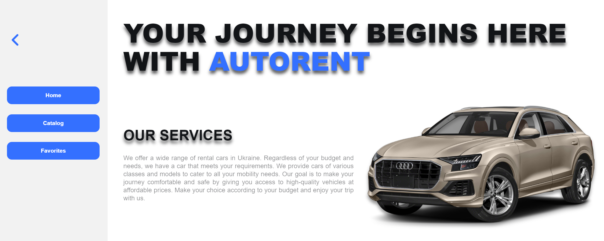
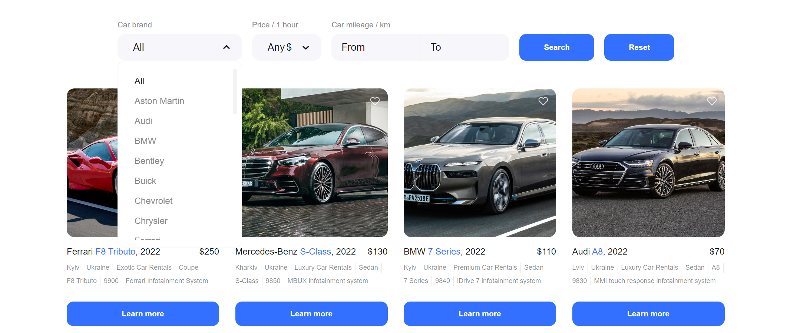
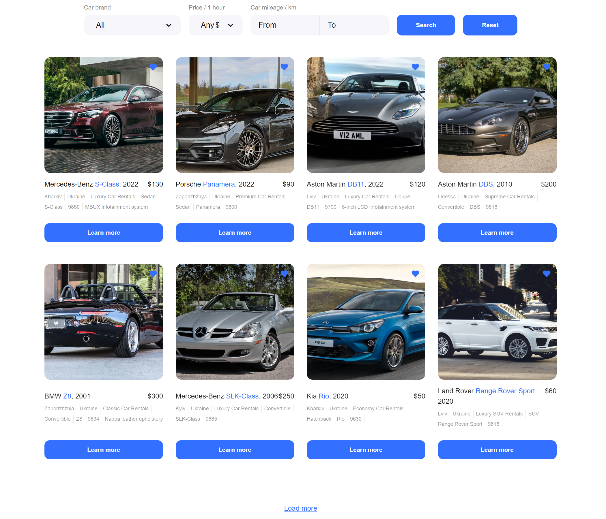
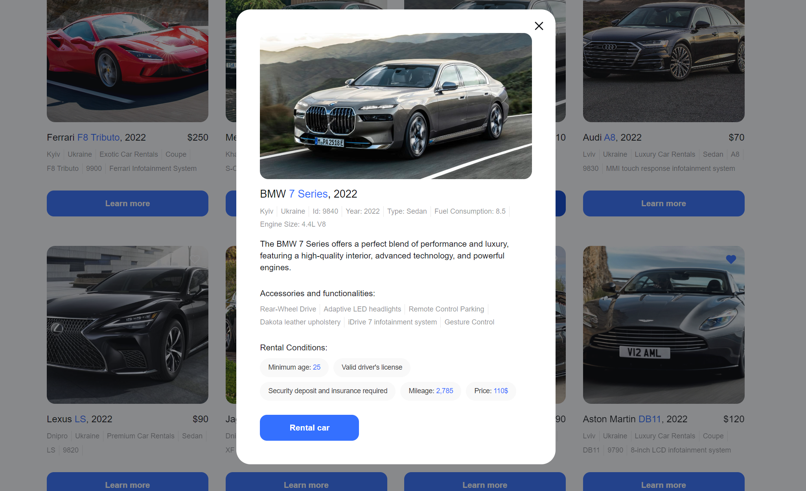

# [AutoRent React WebApp](https://stanislavzhuk.github.io/AutoRent/)

AutoRent is a web application for searching and renting cars, which allows users to quickly find and rent vehicles from various manufacturers and at different price points. With our user-friendly platform, you can browse through a wide selection of car options, discover the perfect vehicle to meet your needs, and even save your favorite listings for future reference. Whether you require a car for a business trip, a family vacation, or simply for your daily commute, our service has got you covered.

## Features

### Explore and Search

- Browse through a diverse selection of cars, including sedans, SUVs, vans, and more.
- Use search filters to quickly find cars that match your preferences, such as make, model, year, and rental price.

### Save to Favorites

- Create a list of your favorite car listings.
- Easily access and compare your saved options.

### Booking and Reservations

- Reserve your chosen car directly from the platform.

## Technologies

## Getting Started

To get started with AutoRent, follow these steps:

1. Before you begin, make sure you have [Node.js](https://nodejs.org/) version 8 or higher installed on your machine.
2. Clone this repository to your local machine.
3. Install the necessary dependencies by running `npm install` or `yarn install`.
4. Start the development server and run the application locally, use the following command `npm start` or `yarn start`.

## Contact Us

If you have any questions, suggestions, or need assistance, feel free to contact our support team at stanislavzhuk.dev@gmail.com.
